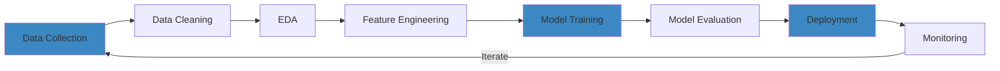

<div align="center">

# 🧠 Hi, I'm Ishaan


</div>

<div align="center">

[](https://ishaands.vercel.app/)
[](https://www.linkedin.com/in/bansalishaan/)
[](mailto:ishaan.ds12@gmail.com)


</div>

---

## 🎯 About Me

```python
class DataScientist:
    def __init__(self):
        self.name = "Ishaan"
        self.role = "Data Science & AI Student"
        self.location = "India"
        self.interests = [
            "Machine Learning",
            "Deep Learning",
            "Data Analysis",
            "Computer Vision",
            "NLP",
            "MLOps"
        ]
        self.currently_learning = ["LLMs", "Neural Networks", "Advanced ML"]

    def say_hi(self):
        print("Thanks for dropping by! Let's build something amazing together!")

me = DataScientist()
me.say_hi()
```

---

## 🛠️ Tech Stack

### 💻 Languages


### 📊 Data Science & ML


### 🧰 Tools & Platforms


---

## 📈 GitHub Stats

<div align="center">


</div>

<div align="center">

[](https://git.io/streak-stats)

</div>

<div align="center">


</div>

---

## 🏆 GitHub Trophies

<div align="center">

[](https://github.com/ryo-ma/github-profile-trophy)

</div>

---

## 🔥 Featured Projects

<div align="center">

### 🤖 AI & Machine Learning

[](https://github.com/ishaands12/ai-data-canvas)

[](https://github.com/ishaands12/finance-assistant)

</div>

---

## 📚 Latest Work



### 🧪 Current Focus Areas
- 🔬 Exploring Large Language Models (LLMs)
- 🧠 Deep Learning architectures (CNNs, RNNs, Transformers)
- 📊 Advanced data visualization techniques
- 🚀 MLOps and model deployment
- 💡 Kaggle competitions

---

## 💡 Skills Breakdown

<div align="center">

| Category | Skills |
|----------|--------|
| **Machine Learning** | Classification, Regression, Clustering, Decision Trees, Random Forests, K-Means |
| **Deep Learning** | Neural Networks, CNNs, RNNs, Transfer Learning |
| **Data Analysis** | EDA, Statistical Analysis, Data Visualization, Feature Engineering |
| **Tools** | Jupyter, Pandas, NumPy, Scikit-learn, TensorFlow, PyTorch |
| **Databases** | SQL, NoSQL |
| **Deployment** | Streamlit, Docker, Flask |

</div>

---

## 📊 Coding Activity

<!--START_SECTION:waka-->
<!--END_SECTION:waka-->

<div align="center">

### 🎓 Learning Path

```
[████████████████████████░░] Python             95%
[█████████████████████░░░░░] Machine Learning   85%
[██████████████████░░░░░░░░] Deep Learning      70%
[████████████████░░░░░░░░░░] Data Viz           65%
[██████████████░░░░░░░░░░░░] MLOps              55%
```

</div>

---

## 🌱 Currently Working On

- Building end-to-end ML pipelines
- Experimenting with neural network architectures
- Contributing to open-source ML projects
- Participating in Kaggle competitions
- Learning advanced NLP techniques

---

## 💬 Let's Connect!

<div align="center">

I'm always open to interesting conversations and collaboration opportunities!

📫 **Reach out to me:**
- 💼 LinkedIn: [LinkedIn Profile](https://www.linkedin.com/in/bansalishaan/)
- 📧 Email: ishaan.ds12@gmail.com
- 🌐 Portfolio: [Portfolio Website](https://ishaands.vercel.app/)

</div>

---

<div align="center">

### 🎯 "Data is the new oil, but only if you know how to refine it"


**Thanks for visiting! Have a great day! 🚀**

</div>

---

<div align="center">


</div>
